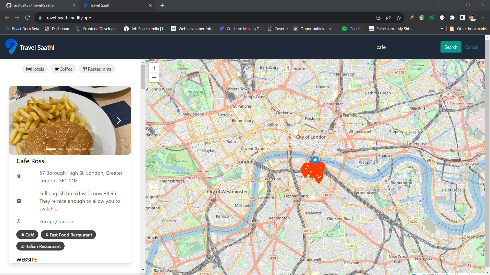

# [Travel Saathi](https://travel-saathi.netlify.app/)

## 📌 Introduction

[](https://awesome.re)

• Built Responsive website using React, JavaScript, and Tailwind CSS
• Utilized the Fetch API to fetch nearby restaurants, hotels, Caf´e, and attractions based on their location
• Integrated an interactive Map component to visualize and present a comprehensive list of nearby places
• Implemented Search feature enabling users to search for and discover new locations

## 🚀 View Live Demo


<pre><center><a href="https://travel-saathi.netlify.app/"><b>travel-saathi.netlify.app</b></a></center></pre>

## 👨‍💻 Tech Stack Used

-   React
-   Tailwind CSS
-   Context Api
-   Fetch Api
-   JavaScript

## 🛠️ Installation Steps

Star and Fork the Repo 🌟 and this will keep us motivated.

1. Clone the repository

```bash
git clone https://github.com/adityaK87/Travel-Saathi
```

2. Change the working directory

```bash
cd Travel-Saathi
```

3. Install dependencies

```bash
npm install
```

4. Run the app

```bash
npm run start
```

## 📸 Screenshots


